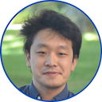

### Summary
Dr. Hayashi is a senior research scientist at Georgia Institute of Technology. He has over fifteen years of experience in conducting and leading research in the programming languages and parallel computing areas. His research interests include:

- Parallel and Distributed Programming Models
- Automatic Parallelizing Compilers
- Just-In-Time Compilers
- Parallel and Distributed Runtime Systems
- Machine-learning for Compiler/Runtime Optimizations
- Resilience for Parallel and Distributed Systems
- GPUs
- Quantum Computing

### Recent Highlights
- A full paper co-authored by Dr. Hayashi has been accepted at SC'24 ([link](https://sc24.conference-program.com/presentation/?id=pap476&sess=sess371)).
- A full paper co-authored by Dr. Hayashi has been accepted at ISC'24 ([link](https://ieeexplore.ieee.org/abstract/document/10528922)).
- Dr. Hayashi received 2024 the Outstanding Research Scientist Award from [the College of Computing](https://www.cc.gatech.edu/) at Georgia Tech ([link](https://www.cc.gatech.edu/annual-awards-and-honors-past-recipients)).
- Papers co-authored by Dr. Hayashi received the Best SCALE Challenge Award at IEEE/ACM CCGRID for two consecutive years ([2023](https://ccgrid2023.iisc.ac.in/awards/) and [2024](https://2024.ccgrid-conference.org/awards/)).
- The IARPA AGILE project, the software aspect of which is led by Dr. Hayashi, was started in September 2022. [link](https://www.iarpa.gov/research-programs/agile)
